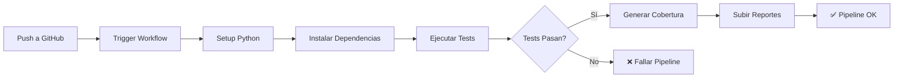

# 🚀 Guía de GitHub Actions - CI/CD Pipeline

## 📋 Workflows Implementados

Se han creado **4 workflows** completos de GitHub Actions para automatizar tests, verificación de arquitectura y despliegue.

## 🔄 Workflows Disponibles

### 1. 🧪 tests.yml - Tests Unitarios

**Trigger:** Push y Pull Requests en todas las ramas

**Jobs:**
- ✅ **test-auth-service** - Ejecuta tests del Auth Service
- ✅ **test-product-service** - Ejecuta tests del Product Service
- ✅ **test-summary** - Genera resumen combinado
- ✅ **code-quality** - Verifica calidad de código

**Características:**
- Ejecuta en Python 3.11 y 3.12 (matrix)
- Tests de Value Objects y Entities
- Genera reportes de cobertura
- Sube reportes a Codecov
- Guarda reportes HTML como artefactos

**Archivo:** `.github/workflows/tests.yml`

### 2. 🚀 ci-cd.yml - Pipeline CI/CD Completo

**Trigger:** Push a main, PRs a main, Releases

**Jobs:**
- ✅ **unit-tests** - Tests unitarios completos
- ✅ **architecture-check** - Verifica arquitectura hexagonal
- ✅ **code-quality** - Análisis de calidad y seguridad
- ✅ **build-images** - Build de imágenes Docker
- ✅ **final-summary** - Resumen final del pipeline

**Características:**
- Build de imágenes Docker
- Push a GitHub Container Registry
- Análisis de seguridad con Bandit
- Verificación de formato con Black
- Linting con flake8

**Archivo:** `.github/workflows/ci-cd.yml`

### 3. 🔍 pr-tests.yml - Validación de Pull Requests

**Trigger:** Apertura o actualización de PRs

**Jobs:**
- ✅ **pr-validation** - Valida el PR completo
- ✅ **pr-checks-summary** - Resumen de validación

**Características:**
- Ejecuta todos los tests
- Verifica cobertura mínima (90%)
- Verifica arquitectura hexagonal
- Comenta automáticamente en el PR con resultados
- Tabla de resultados detallada

**Archivo:** `.github/workflows/pr-tests.yml`

### 4. 🌙 nightly-tests.yml - Tests Nocturnos

**Trigger:** Diario a las 2:00 AM UTC (automático)

**Jobs:**
- ✅ **comprehensive-tests** - Tests completos y exhaustivos

**Características:**
- Ejecuta en múltiples versiones de Python (3.10, 3.11, 3.12)
- Tests con máxima verbosidad
- Análisis de calidad completo
- Análisis de seguridad
- Notificaciones si falla

**Archivo:** `.github/workflows/nightly-tests.yml`

## 📊 Estructura de Archivos

```
.github/
└── workflows/
    ├── tests.yml           # Tests principales
    ├── ci-cd.yml          # Pipeline CI/CD completo
    ├── pr-tests.yml       # Validación de PRs
    ├── nightly-tests.yml  # Tests nocturnos
    └── badges.yml         # Actualización de badges
```

## 🚀 Cómo Funciona

### Flujo de Tests en Push



### Flujo de PR

```
1. Abrir/Actualizar PR
   ↓
2. Ejecutar tests automáticamente
   ↓
3. Verificar arquitectura
   ↓
4. Verificar cobertura > 90%
   ↓
5. Comentar resultados en PR
   ↓
6. Aprobar/Rechazar basado en resultados
```

## 🔧 Configuración

### Variables de Entorno

El pipeline no requiere configuración adicional, pero puedes agregar:

**Secrets opcionales:**
- `CODECOV_TOKEN` - Para subir cobertura a Codecov.io
- `SLACK_WEBHOOK` - Para notificaciones en Slack
- `DOCKER_REGISTRY_TOKEN` - Para registries privados

### Configurar en GitHub

1. Ve a tu repositorio en GitHub
2. Settings → Secrets and variables → Actions
3. Agrega los secrets necesarios

## 📈 Reportes Generados

### Artefactos Disponibles

Cada ejecución genera:

1. **Reporte de Cobertura HTML**
   - Navegación: Actions → Workflow Run → Artifacts
   - Nombre: `auth-service-coverage-report-py3.12`
   - Duración: 30 días

2. **Reporte de Cobertura XML**
   - Automáticamente subido a Codecov
   - Visible en PRs y commits

3. **Logs de Tests**
   - Disponibles en cada job
   - Descargables por 90 días

### Ver Reportes

#### En GitHub Actions:
1. Ve a tu repo → Actions
2. Click en el workflow ejecutado
3. Baja a "Artifacts"
4. Descarga el reporte

#### En Codecov (si configurado):
- https://codecov.io/gh/USUARIO/REPO

## 🎯 Badges para README

Agrega estos badges a tu README.md:

```markdown


```

## 🔍 Detalles de Cada Workflow

### tests.yml - Tests Unitarios

**Cuándo se ejecuta:**
- ✅ Push a cualquier rama
- ✅ Pull Request a cualquier rama
- ✅ Manualmente desde GitHub UI

**Qué hace:**
1. Ejecuta tests de Auth Service (Python 3.11 y 3.12)
2. Ejecuta tests de Product Service (Python 3.11 y 3.12)
3. Genera reportes de cobertura
4. Sube reportes a Codecov
5. Guarda reportes HTML como artefactos
6. Verifica calidad de código
7. Verifica arquitectura hexagonal

**Tiempo estimado:** 3-5 minutos

### ci-cd.yml - Pipeline Completo

**Cuándo se ejecuta:**
- ✅ Push a main
- ✅ Pull Request a main
- ✅ Creación de release

**Qué hace:**
1. Ejecuta tests unitarios
2. Verifica arquitectura hexagonal
3. Análisis de calidad y seguridad
4. Build de imágenes Docker (solo en main)
5. Push a Container Registry (solo en main)
6. Resumen final

**Tiempo estimado:** 5-8 minutos

### pr-tests.yml - Validación de PRs

**Cuándo se ejecuta:**
- ✅ Apertura de PR
- ✅ Actualización de PR
- ✅ Reapertura de PR

**Qué hace:**
1. Ejecuta todos los tests unitarios
2. Verifica cobertura mínima (90%)
3. Verifica arquitectura hexagonal
4. Comenta automáticamente en el PR con resultados
5. Bloquea merge si tests fallan

**Tiempo estimado:** 2-3 minutos

### nightly-tests.yml - Tests Nocturnos

**Cuándo se ejecuta:**
- ✅ Diariamente a las 2:00 AM UTC
- ✅ Manualmente desde GitHub UI

**Qué hace:**
1. Tests en 3 versiones de Python (3.10, 3.11, 3.12)
2. Tests con máxima verbosidad
3. Análisis de calidad exhaustivo
4. Análisis de seguridad
5. Notificaciones si falla

**Tiempo estimado:** 10-15 minutos

## 💡 Tips y Mejores Prácticas

### Ejecutar Workflow Manualmente

1. Ve a tu repo en GitHub
2. Click en "Actions"
3. Selecciona el workflow
4. Click en "Run workflow"
5. Selecciona la rama
6. Click en "Run workflow"

### Ver Resultados

1. GitHub → Actions
2. Click en el workflow ejecutado
3. Expande cada job para ver logs
4. Descarga artefactos si los hay

### Debugging de Workflows

Si un workflow falla:

1. **Lee los logs:** Click en el job que falló
2. **Ejecuta localmente:** Reproduce el error en local
3. **Verifica dependencias:** `requirements-test.txt` actualizado?
4. **Paths correctos:** Workflow ejecuta desde root del repo

### Optimizar Tiempos

**Cachear dependencias:**
```yaml
- uses: actions/setup-python@v5
  with:
    python-version: '3.12'
    cache: 'pip'  # ← Esto cachea las dependencias
```

**Jobs en paralelo:**
- Auth y Product Service se ejecutan en paralelo
- Reduce tiempo total a ~3 minutos

## 🎨 Personalización

### Cambiar frecuencia de Nightly Tests

Edita `nightly-tests.yml`:
```yaml
on:
  schedule:
    - cron: '0 2 * * *'  # Cambiar según necesidad
    # Formato: minuto hora día mes día-semana
    # Ejemplos:
    # - '0 */6 * * *'  # Cada 6 horas
    # - '0 0 * * 1'    # Cada lunes
```

### Agregar Notificaciones Slack

```yaml
- name: 📧 Notificar a Slack
  if: failure()
  uses: slackapi/slack-github-action@v1
  with:
    webhook-url: ${{ secrets.SLACK_WEBHOOK }}
    payload: |
      {
        "text": "❌ Tests fallaron en ${{ github.repository }}"
      }
```

### Agregar Coverage Badge

```yaml
- name: 📊 Generar Coverage Badge
  uses: cicirello/jacoco-badge-generator@v2
  with:
    badges-directory: badges
    generate-coverage-badge: true
```

## 🔒 Seguridad

Los workflows incluyen:

- ✅ **Bandit** - Análisis de vulnerabilidades de seguridad
- ✅ **Safety** - Verificación de dependencias vulnerables
- ✅ **Código estático** - Análisis de code smells
- ✅ **Formato consistente** - Black y isort

## 📚 Recursos

### Documentación Oficial
- [GitHub Actions Docs](https://docs.github.com/en/actions)
- [Workflow Syntax](https://docs.github.com/en/actions/using-workflows/workflow-syntax-for-github-actions)
- [Actions Marketplace](https://github.com/marketplace?type=actions)

### Actions Usadas
- `actions/checkout@v4` - Checkout del código
- `actions/setup-python@v5` - Setup de Python
- `actions/upload-artifact@v4` - Subir artefactos
- `codecov/codecov-action@v4` - Cobertura de código

## ✅ Checklist de Configuración

- [x] Workflows creados en `.github/workflows/`
- [x] Tests unitarios implementados
- [x] `pytest.ini` configurado
- [x] `requirements-test.txt` creado
- [x] Script `verify_structure.py` funcional
- [ ] Secrets configurados (opcional)
- [ ] Badges agregados al README (opcional)
- [ ] Notificaciones configuradas (opcional)

## 🎉 Resultado Final

Con estos workflows tienes:

✅ **CI/CD completo** - Tests automáticos en cada push  
✅ **Validación de PRs** - Comentarios automáticos  
✅ **Tests nocturnos** - Verificación continua  
✅ **Reportes de cobertura** - Métricas de calidad  
✅ **Verificación de arquitectura** - Arquitectura hexagonal validada  
✅ **Análisis de seguridad** - Vulnerabilidades detectadas  
✅ **Multi-versión Python** - Compatibilidad verificada  

## 🚀 Próximos Pasos

1. **Commit y push** los workflows:
   ```bash
   git add .github/
   git commit -m "feat: Add GitHub Actions CI/CD pipeline"
   git push
   ```

2. **Ve a GitHub Actions:**
   - https://github.com/TU-USUARIO/TU-REPO/actions

3. **Observa el primer workflow ejecutándose**

4. **Agrega badges al README** (opcional)

## 📊 Ejemplo de Ejecución

Una vez que hagas push, verás en GitHub:

```
✅ Test Auth Service (py3.11)     2m 30s
✅ Test Auth Service (py3.12)     2m 28s
✅ Test Product Service (py3.11)  2m 25s
✅ Test Product Service (py3.12)  2m 27s
✅ Test Summary                   1m 15s
✅ Code Quality                   1m 45s

Total: 3-5 minutos ⚡
```

---

**Creado:** 2025-01-10  
**Workflows:** 4  
**Estado:** ✅ LISTO PARA USAR  

¡Tu pipeline de CI/CD está listo! 🚀

