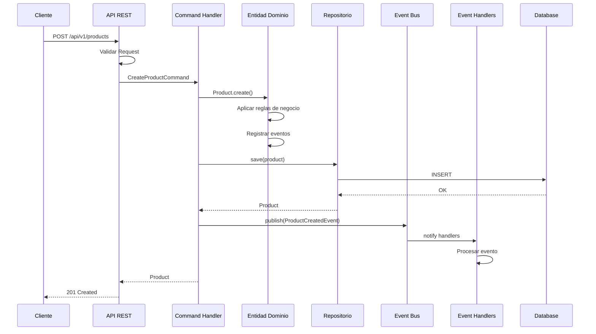
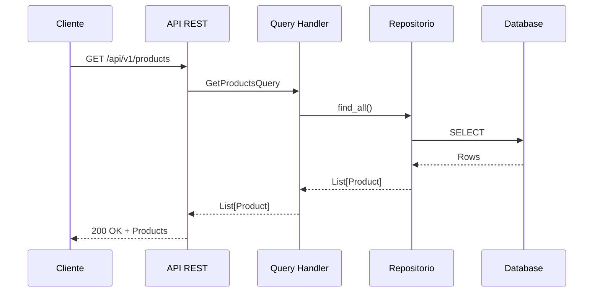
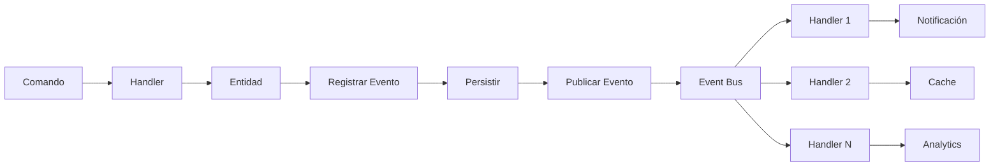

# Arquitectura Hexagonal con CQRS y Event-Driven

## 📐 Visión General

Este proyecto implementa una arquitectura de microservicios utilizando los siguientes patrones y principios:

### Patrones Arquitectónicos

#### 1. Arquitectura Hexagonal (Ports & Adapters)

La arquitectura hexagonal separa el código en tres capas principales:

**Capa de Dominio (Core/Hexágono)**
- **Propósito:** Contiene la lógica de negocio pura
- **Características:** Sin dependencias externas, 100% testeable
- **Componentes:**
  - Entidades: Objetos con identidad única y ciclo de vida
  - Value Objects: Objetos inmutables sin identidad
  - Eventos de Dominio: Hechos que han ocurrido
  - Puertos: Interfaces que definen contratos

```python
# Ejemplo: Entidad User
class User(Entity):
    def __init__(self, user_id: EntityId, email: Email, username: Username):
        super().__init__(user_id)
        self._email = email
        self._username = username
    
    def login(self):
        """Lógica de negocio: registrar login"""
        if not self._is_active:
            raise ValueError("Usuario desactivado")
        self._record_event(UserLoggedInEvent(str(self._id), str(self._username)))
```

**Capa de Aplicación (Use Cases)**
- **Propósito:** Orquesta el flujo de la aplicación
- **Características:** Coordina el dominio sin lógica de negocio
- **Componentes:**
  - Comandos: Intenciones de cambio (escritura)
  - Queries: Intenciones de consulta (lectura)
  - Handlers: Procesan comandos y queries
  - Services: Coordinan operaciones complejas

```python
# Ejemplo: Command Handler
class RegisterUserCommandHandler:
    def __init__(self, repository: IUserRepository, hasher: IPasswordHasher):
        self.repository = repository
        self.hasher = hasher
    
    async def handle(self, command: RegisterUserCommand) -> User:
        # Validar
        if await self.repository.exists_by_email(Email(command.email)):
            raise ValueError("Email ya registrado")
        
        # Crear entidad de dominio
        user = User.register(
            user_id=EntityId(str(uuid4())),
            email=Email(command.email),
            username=Username(command.username),
            hashed_password=HashedPassword(self.hasher.hash_password(command.password))
        )
        
        # Persistir
        user = await self.repository.save(user)
        
        # Publicar eventos
        for event in user.get_domain_events():
            await event_bus.publish(event)
        
        return user
```

**Capa de Infraestructura (Adaptadores)**
- **Propósito:** Implementaciones concretas de interfaces
- **Características:** Dependencias externas (DB, APIs, etc.)
- **Componentes:**
  - Adaptadores: Implementaciones de puertos (JWT, Bcrypt)
  - Repositorios: Acceso a datos (SQLAlchemy, MongoDB)
  - Servicios externos: APIs, message brokers

```python
# Ejemplo: Repositorio
class SQLAlchemyUserRepository(IUserRepository):
    def __init__(self, db: Session):
        self.db = db
    
    async def save(self, user: User) -> User:
        model = self._to_model(user)
        self.db.add(model)
        self.db.commit()
        return user
```

#### 2. CQRS (Command Query Responsibility Segregation)

Separación de operaciones de lectura y escritura.

**Comandos (Escritura)**
- Modifican el estado del sistema
- Validan reglas de negocio
- Generan eventos de dominio
- Retornan entidades o confirmaciones

```python
@dataclass
class CreateProductCommand:
    name: str
    price: float
    stock: int

# Handler
class CreateProductCommandHandler:
    async def handle(self, command: CreateProductCommand) -> Product:
        # Crear entidad
        product = Product.create(...)
        
        # Persistir
        product = await self.repository.save(product)
        
        # Publicar eventos
        await event_bus.publish(product.get_domain_events())
        
        return product
```

**Queries (Lectura)**
- No modifican el estado
- Optimizadas para lectura
- Pueden acceder directamente a read models
- Retornan DTOs o view models

```python
@dataclass
class GetProductsQuery:
    active_only: bool = True

# Handler
class GetProductsQueryHandler:
    async def handle(self, query: GetProductsQuery) -> List[Product]:
        return await self.repository.find_all(active_only=query.active_only)
```

**Ventajas:**
- Escalabilidad independiente de lecturas y escrituras
- Modelos optimizados para cada caso
- Intención clara de cada operación
- Facilita implementar Event Sourcing

#### 3. Event-Driven Architecture

Los eventos son la columna vertebral de la comunicación entre servicios.

**Eventos de Dominio**
- Hechos que han ocurrido en el dominio
- Inmutables
- Contienen toda la información necesaria
- Se publican después de persistir cambios

```python
class ProductCreatedEvent(DomainEvent):
    def __init__(self, product_id: str, name: str, price: float):
        super().__init__()
        self.product_id = product_id
        self.name = name
        self.price = price
    
    def _event_data(self) -> Dict[str, Any]:
        return {
            "product_id": self.product_id,
            "name": self.name,
            "price": self.price
        }
```

**Event Bus**
- Publicación/suscripción de eventos
- Desacopla productores de consumidores
- Permite múltiples suscriptores por evento

```python
# Event Handler
class ProductEventHandler:
    async def on_product_created(self, event: ProductCreatedEvent):
        # Enviar notificación
        await notification_service.send(f"Nuevo producto: {event.name}")
        
        # Actualizar caché
        await cache.invalidate(f"product:{event.product_id}")
        
        # Sincronizar con otros servicios
        await analytics_service.track_product_created(event)

# Configurar suscripciones
event_bus.subscribe("ProductCreatedEvent", handler.on_product_created)
```

**Ventajas:**
- Desacoplamiento entre servicios
- Extensibilidad sin modificar código existente
- Procesamiento asíncrono
- Auditoría y trazabilidad

#### 4. Domain-Driven Design (DDD)

**Entidades**
- Tienen identidad única
- Tienen ciclo de vida
- Contienen lógica de negocio

```python
class Product(Entity):
    def remove_stock(self, amount: int):
        """Lógica de negocio: remover stock"""
        if not self._stock.is_available(amount):
            raise ValueError(f"Stock insuficiente: {self._stock.quantity}")
        
        old_stock = self._stock.quantity
        self._stock = self._stock.remove(amount)
        
        # Registrar evento
        self._record_event(StockUpdatedEvent(str(self._id), old_stock, self._stock.quantity))
        
        # Si stock es bajo, registrar evento adicional
        if self._stock.quantity <= self.LOW_STOCK_THRESHOLD:
            self._record_event(LowStockEvent(str(self._id), self._stock.quantity, self.LOW_STOCK_THRESHOLD))
```

**Value Objects**
- Sin identidad
- Inmutables
- Validación en construcción

```python
@dataclass(frozen=True)
class Email:
    value: str
    
    def __post_init__(self):
        if not self._is_valid():
            raise ValueError(f"Email inválido: {self.value}")
    
    def _is_valid(self) -> bool:
        pattern = r'^[a-zA-Z0-9._%+-]+@[a-zA-Z0-9.-]+\.[a-zA-Z]{2,}$'
        return bool(re.match(pattern, self.value))
```

**Agregados**
- Conjunto de entidades tratadas como una unidad
- Tienen una raíz de agregado
- Garantizan invariantes

## 🎯 Flujos de Datos

### Flujo de Comando (Escritura)



### Flujo de Query (Lectura)



### Flujo de Eventos



## 🏗️ Estructura de Capas

### Dependencias

```
┌─────────────────────────────────────┐
│         API Layer                   │
│     (HTTP/REST/GraphQL)             │
└──────────────┬──────────────────────┘
               │ depends on
               ↓
┌─────────────────────────────────────┐
│      Application Layer              │
│   (Commands, Queries, Handlers)     │
└──────────────┬──────────────────────┘
               │ depends on
               ↓
┌─────────────────────────────────────┐
│        Domain Layer                 │
│  (Entities, VOs, Events, Ports)     │
└──────────────↑──────────────────────┘
               │ implemented by
               │
┌──────────────┴──────────────────────┐
│     Infrastructure Layer            │
│  (Adapters, Repositories, DB)       │
└─────────────────────────────────────┘
```

**Reglas de Dependencia:**
1. El dominio NO depende de nadie
2. La aplicación depende solo del dominio
3. La infraestructura implementa interfaces del dominio
4. La API depende de aplicación e infraestructura

## 🔌 Puertos y Adaptadores

### Puertos (Interfaces)

```python
# Puerto: Define el contrato
class IUserRepository(ABC):
    @abstractmethod
    async def save(self, user: User) -> User:
        pass
    
    @abstractmethod
    async def find_by_id(self, user_id: EntityId) -> Optional[User]:
        pass
```

### Adaptadores (Implementaciones)

```python
# Adaptador SQLAlchemy
class SQLAlchemyUserRepository(IUserRepository):
    def __init__(self, db: Session):
        self.db = db
    
    async def save(self, user: User) -> User:
        # Implementación específica para SQLAlchemy
        ...

# Adaptador MongoDB (alternativo)
class MongoDBUserRepository(IUserRepository):
    def __init__(self, client: MongoClient):
        self.client = client
    
    async def save(self, user: User) -> User:
        # Implementación específica para MongoDB
        ...
```

**Ventaja:** Puedo cambiar de SQLAlchemy a MongoDB sin tocar el dominio ni la aplicación.

## 🎨 Patrones Utilizados

### 1. Repository Pattern
Abstrae el acceso a datos

### 2. Factory Pattern
Construcción de entidades complejas

```python
@staticmethod
def create(product_id: EntityId, name: ProductName, ...) -> Product:
    product = Product(...)
    product._record_event(ProductCreatedEvent(...))
    return product
```

### 3. Strategy Pattern
Diferentes algoritmos intercambiables (hasher, token service)

### 4. Observer Pattern
Event bus con suscriptores

### 5. Dependency Injection
FastAPI Depends para inyectar dependencias

```python
def get_user_repository(db: Session = Depends(get_db)):
    return SQLAlchemyUserRepository(db)

@router.post("/users")
async def create_user(repo: IUserRepository = Depends(get_user_repository)):
    ...
```

## 🧪 Testing Strategy

### Unit Tests (Dominio)
```python
def test_user_login_when_inactive_raises_error():
    user = User(...)
    user.deactivate()
    
    with pytest.raises(ValueError, match="Usuario desactivado"):
        user.login()
```

### Integration Tests (Aplicación + Infraestructura)
```python
async def test_register_user_command_handler():
    # Arrange
    handler = RegisterUserCommandHandler(repository, hasher)
    command = RegisterUserCommand(...)
    
    # Act
    user = await handler.handle(command)
    
    # Assert
    assert user.email == command.email
    assert await repository.find_by_id(user.id) is not None
```

### E2E Tests (API completa)
```python
def test_create_product_endpoint(client: TestClient):
    response = client.post("/api/v1/products", json={...})
    assert response.status_code == 201
    assert response.json()["name"] == "Test Product"
```

## 📊 Escalabilidad

### Escalado Horizontal
- Cada microservicio puede escalar independientemente
- Load balancer distribuye tráfico entre instancias
- Sin estado en los servicios (stateless)

### Escalado de Lecturas vs Escrituras
- CQRS permite escalar lecturas y escrituras independientemente
- Lectura: Múltiples réplicas de solo lectura
- Escritura: Instancia principal con réplicas

### Event Sourcing (Futuro)
- Almacenar todos los eventos
- Reconstruir estado desde eventos
- Time travel y auditoría completa

## 🔐 Seguridad

### Autenticación
- JWT tokens (access + refresh)
- Tokens firmados con HS256
- Expiración configurable

### Autorización
- Scopes en tokens
- Verificación por endpoint
- Roles de usuario

### Validación
- Pydantic en API layer
- Value Objects en Domain layer
- Reglas de negocio en entidades

## 🚀 Deployment

### Containerización
```dockerfile
FROM python:3.11-slim
WORKDIR /app
COPY requirements.txt .
RUN pip install -r requirements.txt
COPY . .
CMD ["uvicorn", "main:app", "--host", "0.0.0.0", "--port", "8001"]
```

### Orquestación
```yaml
services:
  auth-service:
    image: auth-service:latest
    ports:
      - "8001:8001"
    environment:
      - DATABASE_URL=postgresql://...
```

## 📈 Monitoreo y Observabilidad

### Métricas
- Prometheus para recolección
- Grafana para visualización
- Métricas de negocio y técnicas

### Logging
- Logs estructurados (JSON)
- Niveles: DEBUG, INFO, WARNING, ERROR
- Contexto de request ID

### Tracing
- Distributed tracing con Jaeger/Zipkin
- Seguimiento de requests entre servicios
- Performance analysis

## 🎯 Best Practices

1. **Keep Domain Pure:** Sin dependencias externas
2. **Single Responsibility:** Cada clase/módulo tiene una responsabilidad
3. **Dependency Inversion:** Depende de abstracciones, no de implementaciones
4. **Fail Fast:** Validar temprano y fallar rápido
5. **Immutability:** Value Objects inmutables
6. **Event Naming:** Pasado (UserRegistered, ProductCreated)
7. **Command Naming:** Imperativo (RegisterUser, CreateProduct)

## 📚 Recursos Adicionales

- [Clean Architecture - Robert C. Martin](https://blog.cleancoder.com/uncle-bob/2012/08/13/the-clean-architecture.html)
- [Implementing Domain-Driven Design - Vaughn Vernon](https://www.amazon.com/Implementing-Domain-Driven-Design-Vaughn-Vernon/dp/0321834577)
- [Building Microservices - Sam Newman](https://www.amazon.com/Building-Microservices-Designing-Fine-Grained-Systems/dp/1491950358)

---

Esta arquitectura proporciona una base sólida para sistemas escalables, mantenibles y testeables.

